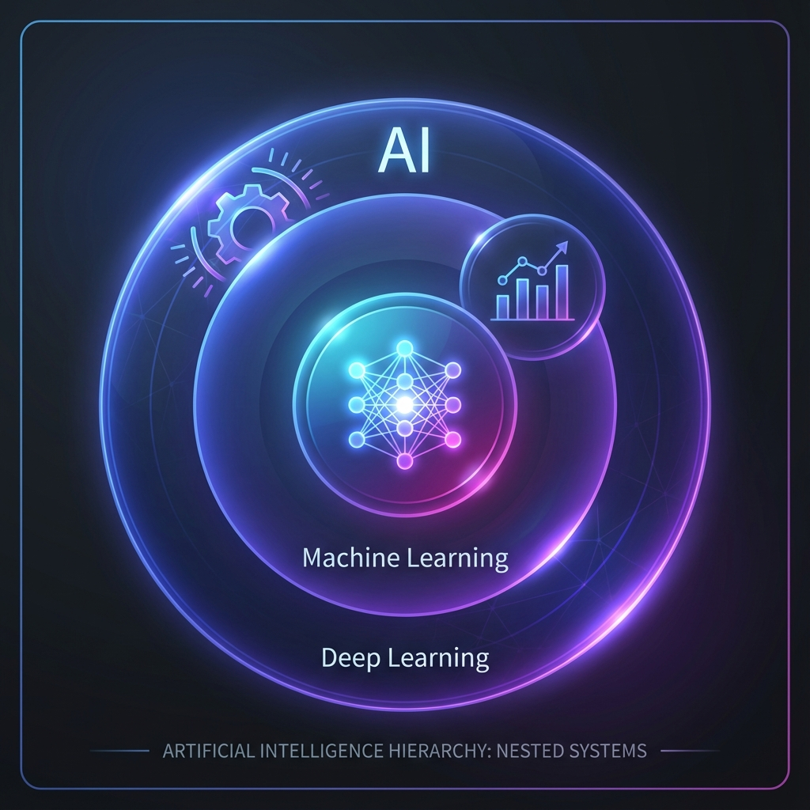
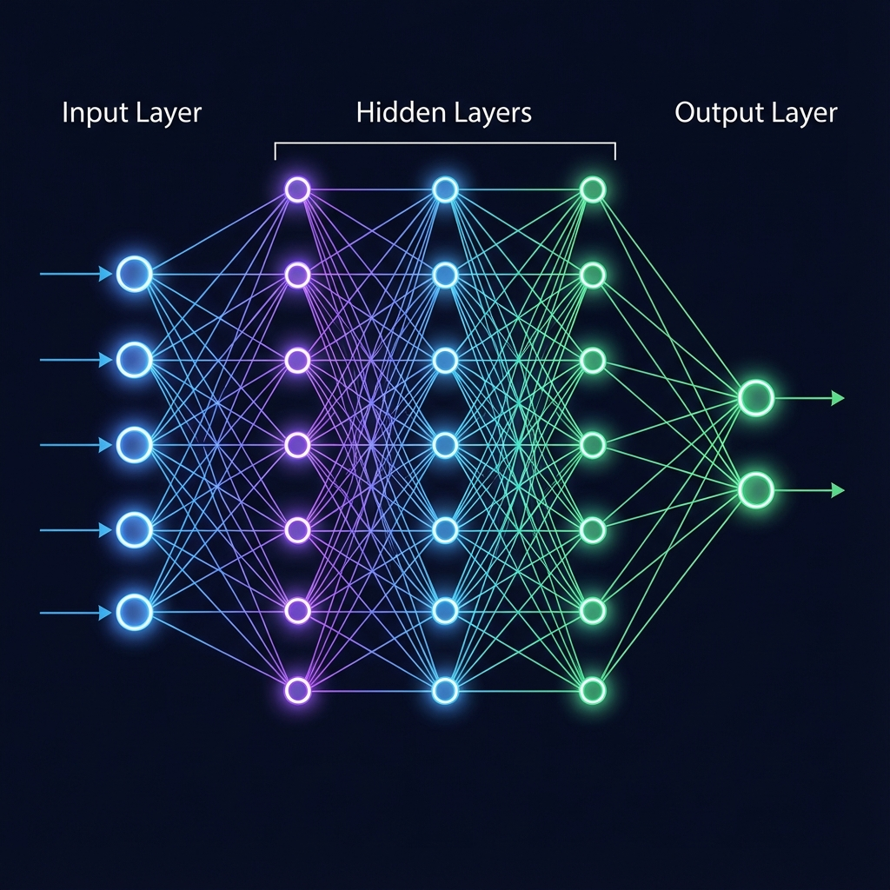

# AI & Machine Learning — The No-Jargon Guide

> **"AI is not about building a brain. It's about building a machine that can recognize patterns in data better and faster than any human ever could."**

So you want to understand AI? Cool. Let's break it down without making your brain hurt. This isn't for computer scientists; it's for leaders who need to know how these tools actually change business.

---

## 📑 Table of Contents

1. [What Even Is AI?](#what-even-is-ai) — Breaking the hype.
2. [AI vs. ML vs. DL](#ai-vs-machine-learning-vs-deep-learning) — The Russian Doll analogy.
3. [A Quick History](#a-quick-history-the-cliff-notes-version) — How we got here.
4. [How Machines Actually Learn](#how-machines-actually-learn) — The 3 main methods.
5. [The Golden Rule: Data](#the-golden-rule-of-ai) — Why your AI is only as good as your data.
6. [Deep Learning — The Magic Sauce](#deep-learning--whats-the-big-deal) — Why things suddenly got so good.
7. [The Architectures (CNN vs RNN)](#neural-network-architectures) — Eyes vs. Memory.
8. [AI in Business — The Reality Check](#ai-in-business--the-practical-stuff) — Prediction vs. Judgment.
9. [Quick Reference Card](#quick-reference-card) — The "Cheat Sheet."

---

## What Even Is AI?

Here's the deal: AI is just **math + data + computing power**. That's it. No magic, no "consciousness," just really sophisticated pattern recognition.

Think of it like this: You've seen thousands of cat photos in your life, so now you can instantly recognize a cat. AI does the same thing, except it needs a million photos. And math. Lots of math.

### The Two Flavors of AI

| Type | What It Means | Real Example |
|------|---------------|--------------|
| **Narrow AI** | Brilliant at **ONE** specific task. | Spotify's recommendations, spam filters, FaceID. |
| **General AI (AGI)** | Human-level smarts across **ANY** task. | Doesn't exist yet. (Think Jarvis from Iron Man). |

> 💡 **Bottom Line:** 100% of the AI you see today is **Narrow AI**. It's a tool, not a person.

---

## AI vs. Machine Learning vs. Deep Learning

People throw these terms around interchangeably. They're nested, like Russian dolls:

*   **Artificial Intelligence:** Any computer doing "smart" stuff. (e.g., A thermostat turning on when it hits 60°F).
*   **Machine Learning:** Systems that improve themselves by looking at data. (e.g., A spam filter that learns new junk phrases over time).
*   **Deep Learning:** ML on steroids using "Neural Networks." This is what allows for FaceID and ChatGPT.

---

## A Quick History (The Cliff Notes Version)

*   **1956:** The term "AI" is born. Everyone is excited.
*   **1970s-90s:** "AI Winters." Lots of hype, but the computers weren't fast enough.
*   **2012:** **The Big Bang.** Researchers realized that gaming chips (GPUs) were perfect for AI math. Computers suddenly became better than humans at recognizing images.
*   **2017:** The **"Transformer"** paper is published. This is the tech that eventually led to ChatGPT and the world changed.

---

## How Machines Actually Learn

There are three ways to train an AI. Think of them like different teaching styles:

### 1. Supervised Learning (The Teacher Method)
You give the AI the data **and** the answers. 
*   **Analogy:** Teaching a kid with flashcards. "This is a cat," "This is a dog."
*   **Business Use:** Predicting if a loan will default based on 10,000 previous loans.

### 2. Unsupervised Learning (The Explorer Method)
You give the AI data but **no answers**. It has to find the patterns itself.
*   **Analogy:** Dumping 1,000 LEGOs on the floor and telling the AI to "group them by similarity."
*   **Business Use:** Customer segmentation—finding groups of buyers you didn't know existed.

### 3. Reinforcement Learning (The Trial & Error Method)
You give the AI a goal and a "reward." 
*   **Analogy:** Training a dog with treats. When it does the right thing, it gets a "point."
*   **Business Use:** Optimizing warehouse robot movements or trading algorithms.

---

## The Golden Rule: Garbage In, Garbage Out

AI doesn't "know" anything; it just repeats patterns it saw in the past.
*   **The Risk:** If your historical data is biased (e.g., only hiring men for 10 years), the AI will learn that "being a man" is a requirement for the job.
*   **The Fix:** You must split your data. Train on 80%, then test it on the other 20% to see if it actually works.

---

## Deep Learning — Why Things Got So Good

Traditional ML needed humans to "feature engineer" (tell the computer what to look for). 
**Deep Learning does this automatically.** 

### How Neural Networks Work

1.  **Input Layer:** Raw data (pixels, text).
2.  **Hidden Layers:** The "magic." Layer 1 finds edges -> Layer 2 finds shapes -> Layer 3 finds objects.
3.  **Output Layer:** The final guess ("It's a cat: 99% probability").

> 📺 **Must Watch:** 3blue1brown’s video [**But what is a neural network?**](https://www.youtube.com/watch?v=aircAruvnKk) is the single best explanation ever made.

---

## Neural Network Architectures (The Right Tool for the Job)

*   **CNNs (Convolutional):** Built for **Vision**. 
    *   *Real World:* Tesla’s cameras identifying a stop sign.
*   **RNNs (Recurrent):** Built for **Sequences**. 
    *   *Real World:* Predicting the next word in your text message.
*   **Transformers:** The "New King." Better at long context and language. 
    *   *Real World:* ChatGPT, Claude, Gemini.

---

## AI in Business — The Reality Check

### 1. The API Revolution
You don't need a PhD to use AI anymore. You just need an API key. You can "rent" the smartest brains in the world (OpenAI, Google) for pennies.

### 2. Prediction vs. Judgment
AI lowers the cost of **prediction** (guessing what will happen).
**Humans** are still the only ones who can provide **judgment** (deciding what to do about it).

> 🔎 **Thought Exercise:** If AI makes "guessing the future" free, what is the most valuable role in your company? (Hint: It's the person who knows which questions to ask).

---

## Quick Reference Card

| Term | What is it? | Simple Analogy |
| :--- | :--- | :--- |
| **Model** | The "Brain" of the AI. | A recipe book. |
| **Training** | Feeding data to the model. | Studying for an exam. |
| **Inference** | Using the model to get an answer. | Taking the exam. |
| **Hallucination** | When the AI confidently lies. | A confident student "faking it" on a test. |

---

### 🎥 Deep Dive: Best Visual Explanations
*   **[But what is a Neural Network?](https://www.youtube.com/watch?v=aircAruvnKk)** (3blue1brown) - 20 mins. The gold standard for understanding the math.
*   **[AI For Everyone](https://www.coursera.org/learn/ai-for-everyone)** (Andrew Ng) - The best high-level overview for non-tech professionals.

---

> [Next Module: Generative AI](../02-Generative-AI)
