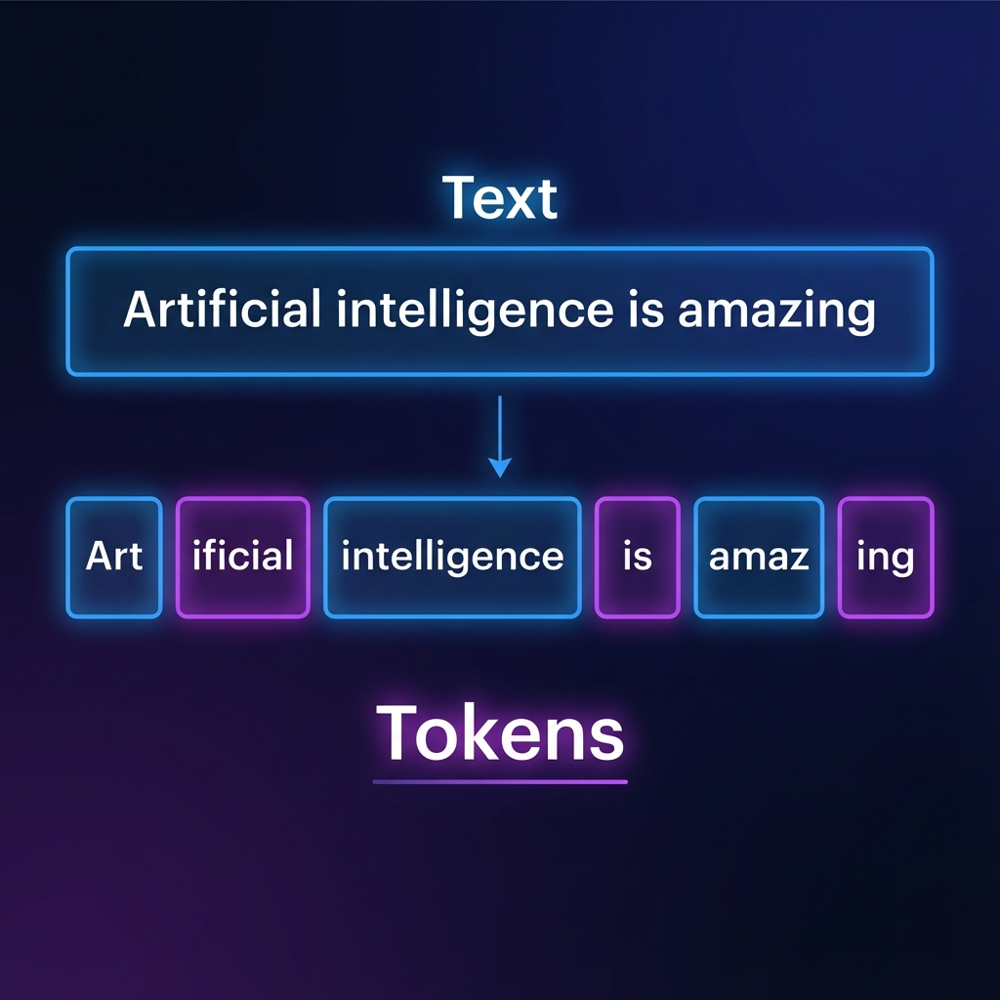

# Generative AI & Large Language Models

> **"Traditional AI was a better librarian; Generative AI is a better writer."**

In Module 1, we learned that AI is about recognizing patterns. Generative AI takes it a step further: it uses those patterns to **create something new**.

---

## 📑 Table of Contents

1. [Introduction to Generative AI](#introduction-to-generative-ai)
2. [Introduction to LLMs](#introduction-to-large-language-models)
   - [Model Evolution](#1-types-of-models-and-evolution)
   - [Pricing (Tokens)](#2-how-are-llms-priced)
   - [Benchmarks](#3-llm-benchmarks)
   - [Context Windows](#4-building-blocks-tokens-and-context)
3. [Prompt Engineering](#prompt-engineering)
   - [Strategies & Strategies](#prompting-strategies)
   - [Parameters (Temperature, etc.)](#controlling-ai-output-using-parameters)
4. [🎥 Deep Dive Videos](#🎥-deep-dive-best-visual-explanations)

---

## Introduction to Generative AI

### What is Generative AI?
Traditional AI follows rules to categorize data (e.g., "Is this email spam?"). Generative AI (GenAI) creates new data (e.g., "Write an email to my boss").

*   **How it works:** It’s trained on a massive chunk of human knowledge (books, code, internet) and calculates the **probability** of what should come next.
*   **The Content Revolution:** GenAI drives the cost of creating a "first draft" of anything—text, code, image, video—to effectively zero.

---

## Introduction to Large Language Models (LLMs)

### 1. Types of Models and Evolution
LLMs have evolved at breakneck speed:
*   **The Early Days:** GPT-1 and GPT-2 were interesting but couldn't hold a long conversation.
*   **The Breakthrough (2020):** GPT-3 showed that "Scale is all you need." The bigger the model, the smarter it got.
*   **The Modern Giants:** 
    *   **OpenAI:** GPT-4o (The standard).
    *   **Anthropic:** Claude 3.5 Sonnet (The "human-like" coder).
    *   **Google:** Gemini 1.5 Pro (The one with the "infinite" memory).
    *   **Meta:** Llama 3 (The open-source king).

### 2. How are LLMs priced?
AI companies don't charge by the word; they charge by the **Token**.
*   **Input Tokens:** The prompt you send.
*   **Output Tokens:** The answer the AI writes.
> 💰 **Pro Tip:** Output tokens are usually much more expensive because they require the computer to "think" in real-time.

### 3. LLM Benchmarks (How to compare them)
Don't trust marketing fluff. Look for these standardized scores:
*   **MMLU:** General knowledge and reasoning.
*   **HumanEval:** Coding ability.
*   **GSM8K:** Grade-school math (surprisingly hard for AI).
*   **LMSYS Chatbot Arena:** The only "live" leaderboard where humans vote on which AI is better.

### 4. Building Blocks: Tokens and Context
LLMs don't see "words." They see **Tokens**.

*   **Tokens:** Think of these as "syllables" or chunks of characters. 1,000 tokens ≈ 750 words.
*   **Context Window:** This is the AI's "Short-term Memory."
    *   If a model has a **128k context window**, it can "read" a whole book and remember the first chapter while talking about the last one.
    *   If you exceed the window, the AI will "forget" the beginning of your conversation.

---

## Prompt Engineering

Prompt engineering is the art of giving an AI a clear, unambiguous goal.

### 1. Foundations of Prompt Engineering
A perfect prompt has three parts:
1.  **Role:** "Act as a world-class lawyer..."
2.  **Context:** "We are reviewing a contract for a SaaS startup..."
3.  **Task:** "Summarize the termination clauses in bullet points."

### 2. Prompting Strategies
*   **Zero-Shot:** No examples. "Translate this to French."
*   **Few-Shot:** Give 2-3 examples first. This drastically improves performance.
*   **Chain of Thought:** Tell the AI to "Think step-by-step." This forces it to solve the logic before it gives you a (potentially wrong) answer.

### 3. Controlling AI Output Using Parameters
Most professional AI tools (OpenAI Playground, Google AI Studio) let you "dial" the AI's personality:

*   **Temperature (0 to 1):**
    *   **Close to 0:** Focused, predictable, conservative. (Best for code/math).
    *   **Close to 1:** Creative, random, "hallucination-prone." (Best for brainstorming).
*   **Top-P:** Another way to control "randomness" (best to leave this alone if you're changing Temperature).
*   **Stop Sequences:** Tell the AI exactly where to stop writing (e.g., stop at "###").

---

## 🎥 Deep Dive: Best Visual Explanations

*   **[Intro to Large Language Models](https://www.youtube.com/watch?v=zjkBMFhNj_g)** (Andrej Karpathy) — **Highly Recommended.** This is the single best 1-hour overview of how LLMs are built and how they "think." Perfect for execs.
*   **[But what is a GPT? Visualizing Transformers](https://www.youtube.com/watch?v=wjZofJX0v4M)** (3blue1brown) — A stunning visual breakdown of the "Attention" mechanism that makes ChatGPT work.

---

> [Next Module: AI Agents & Automation](../03-AI-Agents-Automation)
